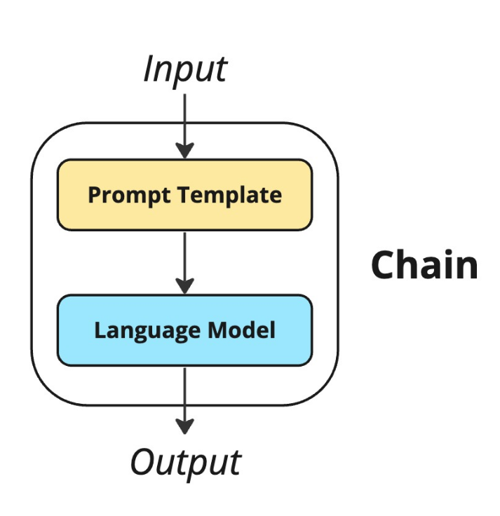
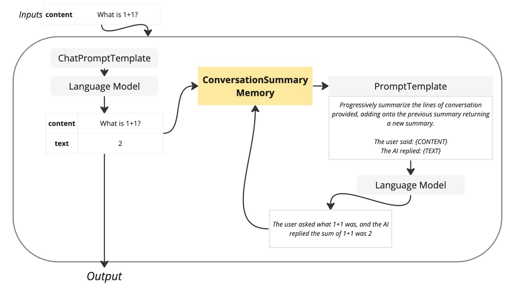
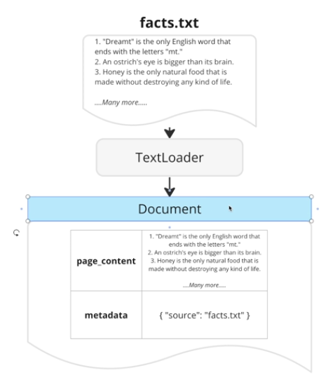

**_Note: All images used in this work are taken from [Stephen's course](https://www.udemy.com/course/chatgpt-and-langchain-the-complete-developers-masterclass/), and all rights are reserved to him. I am using them solely for personal study purposes._**

# Notes

## Langchain

LLM - Large Language Model - Algorithm that generates some amount of text (Palm, BLOOM, gpt 3, LLaMA, GLM, Alpaca, OPT, Camel)
Most follows a completion style of text generation, some have adjusted to use a conversational style of generation (gpt, bard, claude)
There are two styles of interfacing with an LLM - completion and chat. Lanchain refers to completion-abses as llms and chat-based as 'chat models'

An example of how langchain works with an example:
Extract the text > divide into chunks > store a summary of what each chunk is talking about > when you need to generate text find the chunk that is most relevant to the prompt > send it to the llm
Embeddings: array of numbers that describes the absolute fundamental essence of what some text is about. Ex: "I like to eat" => [0.1, 0.2, 0.3, 0.4, 0.5]
There is a special database to store embeddings called Vector Store

Goals of langchain:
Provide tools to automate step of a text generation pipeline make it easy to connect tools together.
A chain is a class provided by langchain to make reusable text-generation pipelines. They can be connected together. A chain wrapes up a promptTemplate and an llm
Embeddings help us to understand the goal of the users search with semantic search. Its a list of numbers that score how much a piece of text is talking about some topic.
Frequently it have 700 to 1500 "dimensions".

Langchain Memories:
The goal of a memory is to store some data in the chain for future use.
When you run a chain the memory receives the input variables and has the ability to add in additional variables

Langchain provides classes to load data from different types called loaders.
TextLoader: txt, PyPDFLoader: pdf, and so on.

The result of loading file is a Document that contains the content (page_content) and the metadata

